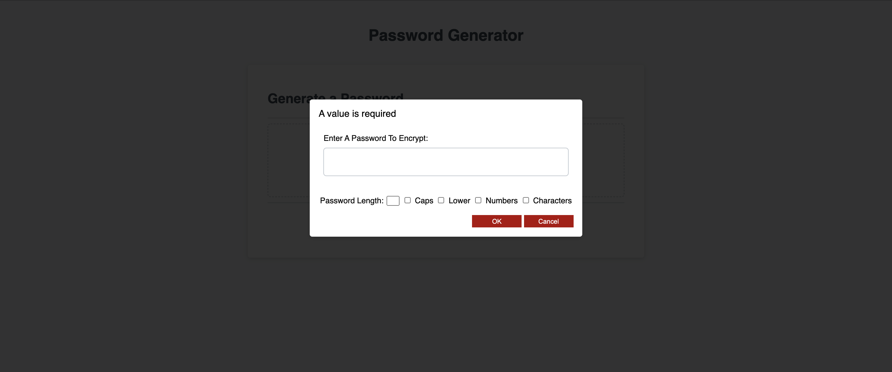
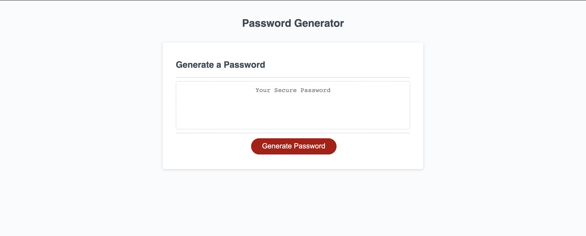

# # Password Generator

Click on the following link to get to the application:
* ['Password-Generator'](https://github.com/NoorA1125/password)

The following images demonstrates the application functionality:




### Summary
The application generates a random password based on user-selected criteria. This app runs in a browser and feature dynamically updated HTML and CSS powered by JavaScript code. It also features a clean and polished user interface and is responsive, it adapts on multiple screen sizes.

## User Story

```
AS AN employee with access to sensitive data
I WANT to randomly generate a password that meets certain criteria
SO THAT I can create a strong password that provides greater security
```

## Application features

```
Secure password:

WHEN clicked on the generate button,
A prompt for will pop up saying: "Enter A Password To Encrypt:" which requires the length of the inputted password to be at leat 8 characters and no more than 128 characters.
Then a the prompt will verify to confirm for password criteria to be 8 characters. 
I've included a lowercase, uppercase, numeric, and/or special characters popup, and new password length which allows you to decided what criteria you want the newpassword to have. It uses an array for each [lower Case, Cap Case, Numbers, Special Characters] and it adds or subsctracts based on your check box selection. So far, only the length works though.
After selected which criteria to include in the password,
The password is generated and the password is displayed in text area with the new criteria (length only for now).

```


